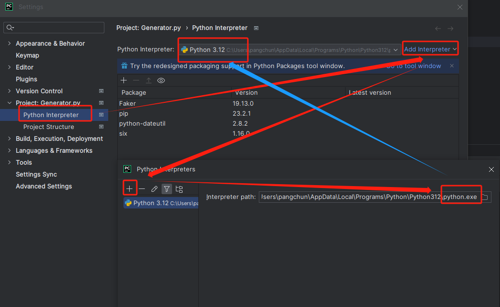

# faker生成百万条测试数据


## 一、安装python


### 1、安装python

https://www.python.org/downloads/windows/


环境变量的选项要勾选上，就不用自己配置环境变量了：


通过cmd检查是否安装成功：（有版本信息就是安装成功）

```bash
C:\Users\pangchun>python
Python 3.12.0 (tags/v3.12.0:0fb18b0, Oct  2 2023, 13:03:39) [MSC v.1935 64 bit (AMD64)] on win32
Type "help", "copyright", "credits" or "license" for more information.
>>>
```


### 2、检查pip命令

pip 是 Python 包管理工具，该工具提供了对Python 包的查找、下载、安装、卸载的功能。（有这个我们才能安装faker类库）

目前如果你在 [python.org](https://www.python.org/) 下载最新版本的安装包，则是已经自带了该工具。


检查pip的版本信息：（直接在cmd窗口运行，不要进入了python后再运行）

```bash
C:\Users\pangchun>pip --version
pip 23.2.1 from C:\Users\pangchun\AppData\Local\Programs\Python\Python312\Lib\site-packages\pip (python 3.12)
```

这是进入python后运行的结果，会有未定义的提示：

```bash

C:\Users\pangchun>python
Python 3.12.0 (tags/v3.12.0:0fb18b0, Oct  2 2023, 13:03:39) [MSC v.1935 64 bit (AMD64)] on win32
Type "help", "copyright", "credits" or "license" for more information.
>>> pip --version
Traceback (most recent call last):
  File "<stdin>", line 1, in <module>
NameError: name 'pip' is not defined. Did you mean: 'zip'?
>>>
```


### 3、运行python代码

1. 方式一：进入python的Dos命令界面直接编写，回车运行；
2. 方式二：写好的文件放到保存成.py的后缀，然后在dos里进入到这个目录，然后运行脚本：python test.py。
3. 方式三：idea中运行文件，具体操作根据编辑器自行百度。


方式三具体介绍：（以PyCharm编辑器为例子）

首先配置我们自己的python环境：




## 二、faker介绍

在软件需求、开发、测试过程中，有时候需要使用一些测试数据，针对这种情况，我们一般要么使用已有的系统数据，要么需要手动制造一些数据。在手动制造数据的过程中，可能需要花费大量精力和工作量，而使用faker生成虚拟数据可以为我们减少这部分的工作量。


详情和相关的api可以查询中文文档：https://hellopython.readthedocs.io/zh-cn/latest/faker_generate_fake_data.html


### 1、安装faker

执行安装命令：

```
pip install Faker
```

安装：

```bash
C:\Users\pangchun>pip install Faker
Collecting Faker
  Obtaining dependency information for Faker from https://files.pythonhosted.org/packages/18/d6/314868f573b09d9f0590a2c2f7dd7463153d3dab1049f0ba5e7008776d91/Faker-19.13.0-py3-none-any.whl.metadata
  Downloading Faker-19.13.0-py3-none-any.whl.metadata (15 kB)
Collecting python-dateutil>=2.4 (from Faker)
  Downloading python_dateutil-2.8.2-py2.py3-none-any.whl (247 kB)
     ---------------------------------------- 247.7/247.7 kB 80.8 kB/s eta 0:00:00
Collecting six>=1.5 (from python-dateutil>=2.4->Faker)
  Downloading six-1.16.0-py2.py3-none-any.whl (11 kB)
Downloading Faker-19.13.0-py3-none-any.whl (1.7 MB)
   ---------------------------------------- 1.7/1.7 MB 420.3 kB/s eta 0:00:00
Installing collected packages: six, python-dateutil, Faker
Successfully installed Faker-19.13.0 python-dateutil-2.8.2 six-1.16.0

[notice] A new release of pip is available: 23.2.1 -> 23.3.1
[notice] To update, run: python.exe -m pip install --upgrade pip
```

检查版本：

```bash
C:\Users\pangchun>faker --version
faker 19.13.0
```


### 2、faker基础用法

先创建一个 xxx.py 的python文件，用编辑器打开：

```python
# 引入包
from faker import Faker

# 实例化并指定地区，不指定时默认 en_US (我需要中文的测试数据，所以选择zh_CN)
fake = Faker('zh_CN')


# 使用fake生成一些数据
name = fake.name()
phone = fake.phone_number()
password = fake.password()
city = fake.city()


# 输出
print('name = ', name)
print('phone = ', phone)
print('password = ', password)
print('city = ', city)
```

结果输出：

```
name =  张丹
phone =  13413524761
password =  !T+ZnzBi6l
city =  昆明县
```


## 三、生成百万数据

生成百万数据并保存到txt文件中。


### 1、python语法：list内循环

要生成多条数据肯定会使用到循环，因此要熟悉python的循环用法。

```python
# list内执行for循环
data1 = [i for i in range(10)]
print('data1: ', data1)

data2 = [[i, i + 1] for i in range(10)]
print('data2: ', data2)
```

结果输出：

```
data1:  [0, 1, 2, 3, 4, 5, 6, 7, 8, 9]
data2:  [[0, 1], [1, 2], [2, 3], [3, 4], [4, 5], [5, 6], [6, 7], [7, 8], [8, 9], [9, 10]]
```


使用faker循环生成10条数据：

```sql
# 引入包
from faker import Faker

# 实例化并指定地区，不指定时默认 en_US (我需要中文的测试数据，所以选择zh_CN)
fake = Faker('zh_CN')

# 使用fake循环生成数据
data = [
    [
        fake.name(),
        fake.random_int(0, 100),
        fake.job(),
        fake.company(),
        fake.address(),
        fake.date_of_birth().strftime("%Y-%m-%d %H:%M:%S"),
        fake.ssn()
    ] for x in range(10)
]

print(data)
```

结果输出：

```
[['罗坤', 100, '中餐厨师', '黄石金承网络有限公司', '辽宁省南昌县和平杨街M座 955145', '2006-11-15 00:00:00',
  '33048119581007751X'],
 ['李桂珍', 90, '通信电源工程师', '新宇龙信息科技有限公司', '福建省福州县朝阳杨街v座 724492', '1911-09-20 00:00:00',
  '510121197706209869'],
 ['张岩', 51, '股票/期货操盘手', '联通时科科技有限公司', '浙江省澳门市南长佛山路r座 979914', '1952-07-03 00:00:00',
  '530321197808142604'],
 ['李芳', 60, '个人业务客户经理', '快讯科技有限公司', '辽宁省婷婷市南溪范路p座 516287', '1997-06-19 00:00:00',
  '23060619450413817X'],
 ['刘想', 33, '底盘工程师', '数字100信息有限公司', '安徽省惠州市和平李街j座 584334', '1997-02-07 00:00:00',
  '621101198901269811'],
 ['项瑞', 73, '调色员', '商软冠联传媒有限公司', '河北省重庆市涪城六盘水路h座 562453', '1995-12-23 00:00:00',
  '230500196012069759'],
 ['郑建华', 75, '律师助理', '雨林木风计算机信息有限公司', '山西省马鞍山市沈北新陈路z座 885128', '2019-05-26 00:00:00',
  '653125196805279007'],
 ['袁凯', 72, '镗工', '太极信息有限公司', '香港特别行政区太原县新城邢街s座 794272', '1966-04-20 00:00:00',
  '450421195311251318'],
 ['刘志强', 97, '展览/展示/店面设计', '思优传媒有限公司', '福建省桂兰市吉区张家港路Q座 554352', '1940-08-31 00:00:00',
  '532801195303069143'],
 ['姜丽娟', 43, '艺术指导/舞台美术设计', '浙大万朋信息有限公司', '陕西省彬市萧山张路B座 123886', '1973-11-06 00:00:00',
  '513223199410118239']]
```


### 2、将python的list数据写入文件

```python
def write():
    # 首先打开文件 (file参数可以使用绝对路径或者相对路径; mode参数为w表示打开一个文件只用于写入.如果该文件已存在则打开文件,并从开头开始编辑,即原有内容会被删除.如果该文件不存在,创建新文件.)
    mock_file = open(file='C:/Users/pangchun/Desktop/faker生成百万条测试数据/Generator/mock_data.sql', mode='w',
                     encoding='utf-8')
    print(len(data_total))
    for row in data_total:
        row_str = '{},{},{},{},{},{},{},{},{}'.format(row[0], row[1], row[2], row[3], row[4], row[5], row[6], row[7],
                                                      row[8])
        mock_file.write(row_str)
        mock_file.write('\n')
    mock_file.close()
    print('文件写入结束')
```


### 3、生成百万行数据

完整代码：

```python
# 引入包
from faker import Faker

# 实例化并指定地区,不指定时默认 en_US (我需要中文的测试数据,所以选择zh_CN)
fake = Faker('zh_CN')

# 使用fake循环生成数据
data_total = [
    [
        x + 1,
        fake.name(),
        fake.random_int(0, 100),
        fake.job(),
        fake.phone_number(),
        fake.company(),
        fake.address(),
        fake.date_of_birth().strftime("%Y-%m-%d %H:%M:%S"),
        fake.ssn()
    ] for x in range(1000000)
]


# 将数据写入文件
def write():
    # 首先打开文件 (file参数可以使用绝对路径或者相对路径; mode参数为w表示打开一个文件只用于写入.如果该文件已存在则打开文件,并从开头开始编辑,即原有内容会被删除.如果该文件不存在,创建新文件.)
    mock_file = open(file='C:/Users/pangchun/Desktop/faker生成百万条测试数据/Generator/mock_data.sql', mode='w',
                     encoding='utf-8')
    print(len(data_total))
    for row in data_total:
        row_str = '{},{},{},{},{},{},{},{},{}'.format(row[0], row[1], row[2], row[3], row[4], row[5], row[6], row[7],
                                                      row[8])
        mock_file.write(row_str)
        mock_file.write('\n')
    mock_file.close()
    print('文件写入结束')


write()
```

生成结果：（已经成功生成一百万行数据，并存入 xxx.sql文件）


